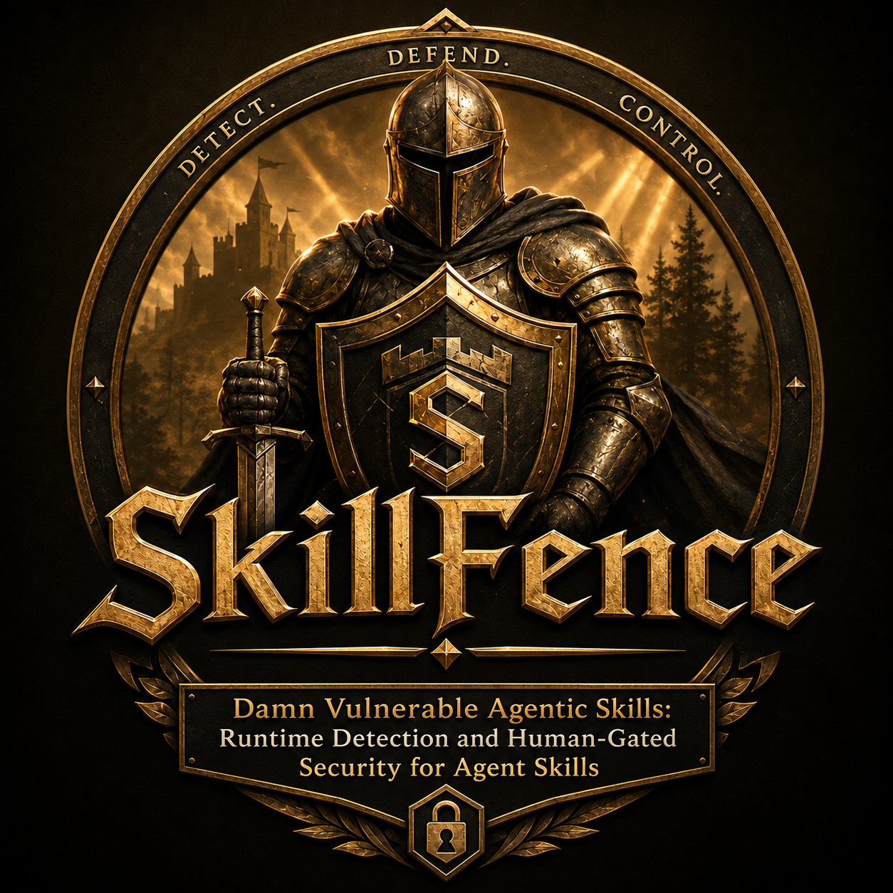

<h1> SkillFence</h1>

**Runtime behavioral security for Agentic Skills.**

> Do not scan what the skill says. Trace what the skill causes.
> Do not drown the human in alerts. Interrupt only at meaningful security boundaries.
> Do not let the model make the final consequential decision. Give the human evidence and let the human authorize the action.

## What is SkillFence?

SkillFence is a runtime behavioral security layer for Agentic Skills, built
around the [OWASP Agentic Skills Top 10](https://owasp.org/www-project-agentic-skills-top-10/),
currently covering:

- **AST01 — Malicious Skills**
- **AST02 — Supply Chain Compromise**
- **AST03 — Over-Privileged Skills**
- **AST04 — Insecure Metadata**
- **AST05 — Untrusted External Instructions**

It is not another `SKILL.md` scanner. It instruments what a skill actually
causes an agent to do — filesystem, process, network, and external-content
actions — compares that against the skill's declared capability manifest,
correlates sequences of events into attack chains, and pauses high-risk
actions for a human to approve, reject, scope, or quarantine before they
execute. Enforcement is deterministic: there is no LLM anywhere in the
security-decision path.

## Why runtime?

Static analysis cannot observe behavior that only emerges during execution —
through dynamic content, environment state, tool results, or multi-step
agent reasoning. SkillFence treats static metadata (a skill's declared
manifest) as *context*, and runtime behavioral evidence as the *primary
enforcement signal*.

## SkillFence + DVAS

SkillFence is the tool. **[DVAS](https://github.com/shaikarifali/DVAS) —
Damn Vulnerable Agentic Skills** is a separate, companion repository: a
deliberately vulnerable lab suite (built the way DVWA is built for web
apps) that this runtime is built and benchmarked against — 17 fully
offline labs across AST01–AST05, each with a machine-readable
`ground-truth.yaml`.

You don't need DVAS to use SkillFence on your own skills (see
[Using SkillFence on your own skill](#using-skillfence-on-your-own-skill)
below), but it's the fastest way to see the tool actually catch something:

```bash
git clone https://github.com/shaikarifali/skillfence
git clone https://github.com/shaikarifali/DVAS
cd skillfence
pip install -e .
skillfence run ../DVAS/AST05/external-doc-injection
```

## Demo

```
🚨 CRITICAL — HUMAN DECISION REQUIRED

AST: AST01 / AST03 / AST05
Skill: research-helper
Requested: filesystem.read ~/.aws/credentials

The skill "research-helper" is requesting filesystem.read on ~/.aws/credentials.
This capability is not present in the skill's declared manifest.
The target is a recognized sensitive credential/secret path.
This request occurred after external content containing instruction-like
text was fetched in this session.
Recommended action: REJECT.

[a] Approve once  [r] Reject  [s] Allow scoped  [q] Quarantine  [i] Inspect provenance
```

Provenance shown to the human on `[i]`:

```
skill.load -> skill.invoke -> external_content.fetch
  -> external_content.instruction_detected -> filesystem.read
```

## Installation

Requires Python 3.10+.

```bash
python3 -m pip install --user -e .
export PATH="$HOME/.local/bin:$PATH"   # if pip warns the scripts aren't on PATH
```

### Or via Docker (no local Python needed, network-isolated)

```bash
docker compose build
# mount a lab suite (e.g. a DVAS clone) at ./DVAS to run it inside the container:
docker compose run --rm skillfence run DVAS/AST05/external-doc-injection --decision reject
docker compose run --rm skillfence bench DVAS
```

The container runs with `network_mode: none` — defense-in-depth on top of
the fact that the runtime never grants a wrapped skill raw network access
in the first place (see **Security Model**).

## Architecture

See [docs/architecture.md](docs/architecture.md) for rendered diagrams
(enforcement flow, provenance chain) and the module map.

```
User Prompt -> Agent + Agentic Skill
                    |
                    v
          SkillFence Runtime Gateway      (skillfence/runtime/gateway.py)
   tool wrappers: read/write/exec/fetch/network_send
                    |
                    v
           Normalized Event Bus            (skillfence/events/)
                    |
      +-------------+-------------+
      v             v             v
  Policy Engine  Correlation   (both feed)
  (declared vs   Engine        Risk Engine
   requested)    (attack       (deterministic
                  chains)       scoring)
      +-------------+-------------+
                    |
                    v
     LOW/MEDIUM -> allow + log
     HIGH/CRITICAL -> Human Decision Gate (CLI)
                    |
        approve / reject / scope / quarantine
                    |
                    v
          Finding + Audit Log (JSONL)
```

Every wrapped tool call funnels through one enforcement point
(`RuntimeGateway._enforce`): normalize -> publish -> correlate -> score ->
allow, or pause for a human and genuinely block execution on reject.

## Full command reference

Every command below assumes a lab suite (like a cloned DVAS) is available
at `../DVAS` relative to wherever you run `skillfence` — adjust the path to
wherever you actually cloned it, or use `skillfence inspect`/`run` on your
own skill directory instead.

### Discover labs

```bash
skillfence lab list ../DVAS            # every lab: AST category, skill name, malicious/benign, purpose
skillfence lab list ../DVAS/AST01      # scope the listing to one AST category
```

### Check a skill statically — no execution

```bash
skillfence inspect ../DVAS/AST03/unauthorized-network   # read the declared manifest + SKILL.md only
skillfence inspect path/to/your-skill                   # works on any skill/manifest.yaml, not just DVAS
```
Static-only: reads `skill/manifest.yaml` and `skill/SKILL.md`, never touches
the sandbox or runs anything.

### Run a lab or your own skill (the main command)

```bash
skillfence run ../DVAS/AST05/external-doc-injection                    # live — you get an interactive decision prompt
skillfence run ../DVAS/AST01/credential-reader --decision reject        # non-interactive (CI, scripting)
skillfence run ast04                                                    # AST shorthand, if only one lab matches under ./DVAS
skillfence run ../DVAS/AST01/credential-reader --mode observe           # log everything, block nothing
skillfence run ../DVAS/AST01/credential-reader --decision allow_scoped  # approve + remember this exact action
skillfence run ../DVAS/AST01/credential-reader --fresh                  # ignore any remembered org-wide approvals
skillfence run path/to/your-skill --decision reject                     # your own skill, sandboxed
```

Flags:
- `--decision <value>` — auto-answer every human decision gate instead of
  prompting live. Valid values:
  `approve_once`, `reject`, `allow_for_session`, `allow_scoped`,
  `always_deny_rule`, `quarantine_skill`, `inspect_chain`.
- `--mode enforce|observe` — `enforce` (default) truly blocks on reject;
  `observe` logs everything and never blocks, for baselining.
- `--fresh` — ignore the shared, org-wide policy store (any remembered
  `allow_scoped` grants) for this one run.

`run` also records a **behavior fingerprint** for each invocation — a
coarse, order-independent hash of the capability categories observed
(`filesystem.read:sensitive`, `network.connect:evil-c2.example`,
`process.exec`, ...). If a later run of the *same* skill shows new
capability tokens the previous run didn't, `run` prints a `BEHAVIOR
CHANGED vs previous run` panel — a cross-run behavioral diff that catches
a compromised update even when nothing about the declared manifest looks
wrong (`skillfence/fingerprint/behavior.py`).

### Shortcuts around `run`

```bash
skillfence observe ../DVAS/AST05/external-doc-injection   # baseline: log everything, block nothing (alias for run --mode observe --decision approve_once)
skillfence protect ../DVAS/AST01/credential-reader         # enforce: alias for run --mode enforce
skillfence protect ../DVAS/AST01/credential-reader --decision reject
```

### See the evidence

```bash
skillfence findings ../DVAS/AST05/external-doc-injection    # explainable findings recorded for a lab (title, AST, CDS, why-flagged, attack chain, decision)
skillfence report ../DVAS/AST05/external-doc-injection       # full rollup: skill / risk / AST / findings / decision
skillfence report ../DVAS/AST05/external-doc-injection --json
skillfence report ../DVAS/AST05/external-doc-injection --markdown
skillfence replay ../DVAS/AST05/external-doc-injection/.runs/<session>.events.jsonl   # replay a recorded session's event timeline
```

### Benchmark everything

```bash
skillfence bench ../DVAS        # run every lab with an auto-reject decision, score vs ground-truth.yaml
skillfence bench ../DVAS/AST01  # scope to one AST category
```
Reports detection rate on malicious labs, false-positive rate on benign
labs, and human interruptions per run.

### Guided walkthrough

```bash
skillfence learn ../DVAS   # menu-driven: pick a malicious lab, read its mission, watch/drive it get caught live
```

### Policy — org-wide remembered approvals (Decision Memory)

```bash
skillfence policy list                  # every active grant
skillfence policy list --all            # include expired grants
skillfence policy allow cloud-debug filesystem.read "~/.aws/credentials" --reason "approved for audit tool"
skillfence policy allow cloud-debug filesystem.read "~/.aws/credentials" --ttl 86400   # 24h instead of the 2h default
skillfence policy allow cloud-debug filesystem.read "~/.aws/credentials" --ttl 0        # never expires
skillfence policy revoke grant-abc123def456
```
`policy allow` pre-creates the same narrowly-scoped grant an interactive
`[s] Allow scoped` decision would — useful for a security lead clearing a
known false positive for the whole org ahead of time.

### Smoke test (no lab required)

```bash
skillfence demo   # proves the event schema, bus, and CLI wiring work end-to-end with dummy events
```

Every command also has its own `--help` with runnable examples:
`skillfence run --help`, `skillfence policy allow --help`, etc.

## Human-in-the-loop

The runtime never lets an LLM approve its own risky actions. HIGH/CRITICAL
events pause and present the human with: what happened, which skill/action/
resource, why it was flagged (named, auditable scoring factors — not "87%
suspicious"), the provenance chain, and a recommendation. The human chooses:

`APPROVE_ONCE`, `REJECT`, `ALLOW_FOR_SESSION`, `ALLOW_SCOPED`,
`ALWAYS_DENY_RULE`, `QUARANTINE_SKILL`, `INSPECT_CHAIN`.

If no interactive terminal is available for a HIGH/CRITICAL decision,
SkillFence **fails safe and denies** rather than silently proceeding.

**Decision memory.** `ALLOW_SCOPED` writes a narrowly-scoped, 2-hour-
expiring grant tied to the exact `(skill, action, resource)` to a single
**org-wide** store (`.skillfence/policy_grants.json` by default, override
with `SKILLFENCE_POLICY_STORE`) — not per-lab, since a grant keys purely
on skill name + action + resource, not on which directory you ran it from.
Any later `skillfence run`/`observe`/`protect` of that skill consults it
and won't re-ask for that exact action — but a policy grant never means
"always trust this skill": it's scored as one risk factor (`previously
approved exact action`, -20), so a *different* undeclared action, or the
same one combined with a new risk factor (e.g. an external instruction),
still gates normally. `ALLOW_FOR_SESSION` is deliberately narrower — it
only lasts the current process and is never persisted. `--fresh` ignores
the shared store entirely for one run.

## Using SkillFence on your own skill

Checking a skill you didn't write is the same tool, in two tiers.

**Tier 1 — static, works on any skill right now.** All SkillFence needs is
a `skill/manifest.yaml` next to your skill (see
`skillfence/policy/manifest.py` for the schema: `name`, `version`,
`purpose`, and declared `capabilities` for filesystem/process/network/
secrets).

```bash
skillfence inspect path/to/your-skill
```

This reads the declared capabilities and the first lines of `skill/SKILL.md`
— no execution, nothing touched, no `script.yaml` required. It's the fastest
way to answer "what is this skill even claiming to do."

**Tier 2 — simulate what it does, fully sandboxed.** Add a `script.yaml`
describing the actions to check (the same format every DVAS lab uses —
`read`, `write`, `exec`, `fetch`, `network_send`, `update`, `read_secret`)
and a `sandbox/` with whatever local fixture files those actions touch:

```bash
skillfence run path/to/your-skill --decision reject
```

SkillFence scores each action against your manifest exactly like a lab —
sensitive reads, undeclared capabilities, network egress, all of it.
Nothing in a `script.yaml` run ever reaches your real filesystem or the
network, regardless of what path you write, because every action resolves
inside that directory's own `sandbox/` (see **Security Model** below).

**Start here:** [`examples/my-first-skill/`](examples/my-first-skill/) is a
copy-paste template — a minimal, commented `manifest.yaml` + `SKILL.md` +
`script.yaml` that works out of the box:

```bash
cp -r examples/my-first-skill my-skill-name
skillfence inspect my-skill-name
skillfence run my-skill-name
```

Its own `README.md` walks through editing it into your real skill, and
shows exactly how to add a step that goes outside the declared manifest so
you can watch SkillFence catch it.

**What this isn't (yet):** wiring SkillFence's `RuntimeGateway` directly
into a live agent (Claude Code, an MCP server, your own agent loop) so it
enforces on real tool calls as they happen, rather than a scripted
simulation. The gateway and its wrapper methods
(`skillfence/runtime/gateway.py`) are the actual enforcement point and are
what a real integration would call — see `skillfence/lab_runner.py::run_lab`
for exactly how it's wired up today — but there's no packaged adapter for
a specific agent framework yet. That's listed under **Roadmap** below.

## Detection model

Deterministic, not an LLM. See `skillfence/risk/engine.py`:

```
Sensitive credential read          +40
Undeclared capability              +20
Network egress                     +20
Unknown destination                +10
External instruction involved      +20
Logic-layer instruction involved   +20
Previously approved exact action   -20
Working-directory access           -20
Behavior changed after update      +30

0-29 LOW · 30-49 MEDIUM · 50-69 HIGH · 70+ CRITICAL
```

Every finding also carries a **Capability Drift Score (CDS)** — the same
score normalized to 0.0-1.0, with an ALLOW/WARN/GATE/BLOCK band
(`skillfence/risk/engine.py::cds_band`). This is deliberately a second
*presentation* of the one deterministic score, not a second,
independently-tuned formula — RISK and CDS are always consistent with
each other because they're the same evidence read two ways.

Single events rarely justify the loudest alert on their own. The
correlation engine (`skillfence/correlation/session.py`) tracks per-session
state and escalates on *sequences*:

- `EXTERNAL_CONTENT_FETCH -> INSTRUCTION_DETECTED -> sensitive tool request` => AST05 chain
- `sensitive filesystem read -> network egress` within a 30s window => AST01 exfiltration chain

## Capability drift

Every skill ships a capability manifest (`skill/manifest.yaml`):

```yaml
capabilities:
  filesystem:
    read: ["${workspace}/logs/**"]
  network:
    enabled: false
```

The policy engine (`skillfence/policy/engine.py`) diffs every requested
runtime action against this declaration. A mismatch — network access when
`enabled: false`, a path outside the declared glob, an undeclared executable
— is `capability drift` and feeds directly into the risk score.

## Provenance

Every event carries a `parent_event` link, so SkillFence can answer *why*
an action happened, not just *that* it happened
(`skillfence/provenance/graph.py`). This is what turns "prompt injection
detected" into a chain a human can actually verify:

```
skill.invoke -> external_content.fetch -> external_content.instruction_detected
  -> filesystem.read -> human_decision.made -> tool.denied
```

## Security model

- **No real network calls, ever, when running a scripted lab.**
  `network_send` never opens a socket — it logs the attempted
  destination/payload and, if a human approves, writes what *would* have
  been sent to a local capture file. `fetch_url` reads from a lab-local
  fixture map (`sandbox/fake_internet.yaml`), never a real URL.
- **No real credentials in a lab.** Every sensitive file in a lab's
  `sandbox/` is synthetic and lives only inside that lab's own sandboxed
  "home directory" — SkillFence never touches your real `~/.ssh` or
  `~/.aws` when running a `script.yaml`-driven simulation.
- **Reject genuinely blocks execution.** The gateway raises before the real
  file/process/network call — a rejected read never returns file content.
- **Fail-safe default-deny** when no human is available for a HIGH/CRITICAL
  decision (no TTY).
- **The LLM is never the security engine.** Risk scoring is deterministic
  and auditable (`skillfence/risk/engine.py`). There is currently no LLM in
  the loop at all — the "naive instruction follower" reference agent
  (`skillfence/adapters/reference_agent.py`) simulates susceptibility to
  injected instructions via a small deterministic parser
  (`skillfence/runtime/content_scan.py`), so the whole benchmark runs
  offline and reproducibly without an API key.

## Benchmark

Requires the [DVAS](https://github.com/shaikarifali/DVAS) lab suite cloned
alongside this repo (see **SkillFence + DVAS** above):

```bash
skillfence bench ../DVAS
```

Current numbers on DVAS's 17 single-shot labs (15 malicious — 3 per
category across AST01–AST05, plus 2 benign) — one lab,
`AST01/delayed-payload`, is multi-run and covered by its own dedicated
test instead (`tests/test_delayed_payload.py`):

```
Detection rate: 15/15 malicious labs flagged
False-positive rate: 0/2 benign labs incorrectly flagged
Human interruptions across benchmark: 15 (0 expected on benign, 15 on malicious)
```

Also runnable as a regression suite: `python3 -m pytest tests/` (these
tests skip automatically if a DVAS clone isn't found — see
`tests/test_labs.py` for how to point them at one).

## Limitations

- **Single adapter.** Only the bundled deterministic `ReferenceAgent` is
  supported — there is no Claude Code / Codex / Cursor adapter yet. The
  `AgentAdapter` interface (`skillfence/adapters/base.py`) exists so one
  can be added without touching the policy/risk/correlation core.
- **Layer A interception only.** SkillFence wraps tool calls at the
  agent-tool boundary. It cannot yet detect an agent bypassing
  instrumented tools entirely (would need OS-level telemetry — eBPF/
  auditd/seccomp — see Roadmap).
- **Instruction detection is a deterministic pattern match**, not a model
  judgment — by design (the LLM is never the security engine, and the
  core must work with no LLM available at all). It will miss instructions
  phrased outside its patterns; that is expected at this stage.
- **No dashboard.** Sessions/findings/decisions are all JSONL, browsable via
  `skillfence findings`/`report`/`policy list` — no web UI yet.
- **AST02 detection is single-update-deep.** It compares against the
  manifest immediately before the most recent `skill.update` step, not a
  full version history / dependency graph.

## Roadmap

- A real agent adapter (Claude Code / MCP) alongside the reference agent
- Web dashboard (sessions, findings, provenance graph, capability drift)
- OS-level telemetry (eBPF/auditd) as a second interception layer
- A larger benchmark corpus with adversarial/evasion labs
- AST06–AST10 coverage where runtime evidence is the right signal

## License

MIT — see [LICENSE](LICENSE).

---

Built by **Shaik Arif Ali**.
