<h1 align="center">
  <br>
  SkillFence
</h1>

**Runtime behavioral security for Agentic Skills.**

> Do not scan what the skill says. Trace what the skill causes.
> Do not drown the human in alerts. Interrupt only at meaningful security boundaries.
> Do not let the model make the final consequential decision. Give the human evidence and let the human authorize the action.

## What is SkillFence?

SkillFence is a runtime behavioral security layer for Agentic Skills, built
around the [OWASP Agentic Skills Top 10](https://owasp.org/www-project-agentic-skills-top-10/),
currently covering:

- **AST01 — Malicious Skills**
- **AST02 — Supply Chain Compromise**
- **AST03 — Over-Privileged Skills**
- **AST04 — Insecure Metadata**
- **AST05 — Untrusted External Instructions**
- **AST06 — Weak Isolation** (sandbox/path-traversal escape detection)
- **AST07 — Update Drift** (MCP tool description rug-pull detection)
- **AST08 — Poor Scanning** (a runtime finding contradicting a skill's own "already scanned" claim)
- **AST09 — No Governance** (fleet-wide inventory of never-reviewed skills and ungoverned grants)
- **AST10 — Cross-Platform Reuse** (capability widening during a platform migration)

Full [OWASP Agentic Skills Top 10](https://owasp.org/www-project-agentic-skills-top-10/) coverage.

It is not another `SKILL.md` scanner. It instruments what a skill actually
causes an agent to do — filesystem, process, network, and external-content
actions — compares that against the skill's declared capability manifest,
correlates sequences of events into attack chains, and pauses high-risk
actions for a human to approve, reject, scope, or quarantine before they
execute. Enforcement is deterministic: there is no LLM anywhere in the
security-decision path.

Protecting a real MCP server adds one more thing beyond instrumenting
agent-caused actions: the [MCP proxy](#mcp-proxy--protect-a-real-mcp-server-live)
also passively scans content a real server sends *before* the agent ever
acts on it — tool descriptions (poisoning, rug-pull) and tool responses
(live secrets) — independent of whether any tool call happens at all.

## Why runtime?

Static analysis cannot observe behavior that only emerges during execution —
through dynamic content, environment state, tool results, or multi-step
agent reasoning. SkillFence treats static metadata (a skill's declared
manifest) as *context*, and runtime behavioral evidence as the *primary
enforcement signal*.

## SkillFence + DVAS

SkillFence is the tool. **[DVAS](https://github.com/shaikarifali/DVAS) —
Damn Vulnerable Agentic Skills** is a separate, companion repository: a
deliberately vulnerable lab suite (built the way DVWA is built for web
apps) that this runtime is built and benchmarked against — 17 fully
offline labs across AST01–AST05, each with a machine-readable
`ground-truth.yaml`.

You don't need DVAS to use SkillFence on your own skills (see
[Using SkillFence on your own skill](#using-skillfence-on-your-own-skill)
below), but it's the fastest way to see the tool actually catch something:

```bash
git clone https://github.com/shaikarifali/skillfence
git clone https://github.com/shaikarifali/DVAS
cd skillfence
pip install -e .
skillfence run ../DVAS/AST05/external-doc-injection
```

## Demo

```
🚨 CRITICAL — HUMAN DECISION REQUIRED

AST: AST01 / AST03 / AST05
Skill: research-helper
Requested: filesystem.read ~/.aws/credentials

The skill "research-helper" is requesting filesystem.read on ~/.aws/credentials.
This capability is not present in the skill's declared manifest.
The target is a recognized sensitive credential/secret path.
This request occurred after external content containing instruction-like
text was fetched in this session.
Recommended action: REJECT.

[a] Approve once  [r] Reject  [s] Allow scoped  [q] Quarantine  [i] Inspect provenance
```

Provenance shown to the human on `[i]`:

```
skill.load -> skill.invoke -> external_content.fetch
  -> external_content.instruction_detected -> filesystem.read
```

## Installation

Requires Python 3.10+.

```bash
pip install skillfence
```

### From source (editable, for development)

```bash
python3 -m pip install --user -e .
export PATH="$HOME/.local/bin:$PATH"   # if pip warns the scripts aren't on PATH
```

### Or via Docker (no local Python needed, network-isolated)

```bash
docker compose build
# mount a lab suite (e.g. a DVAS clone) at ./DVAS to run it inside the container:
docker compose run --rm skillfence run DVAS/AST05/external-doc-injection --decision reject
docker compose run --rm skillfence bench DVAS
```

The container runs with `network_mode: none` — defense-in-depth on top of
the fact that the runtime never grants a wrapped skill raw network access
in the first place (see **Security Model**).

## Architecture

See [docs/architecture.md](docs/architecture.md) for the module map.

Every real action — from any of the five entry points below — funnels
through one enforcement point (`RuntimeGateway._enforce`): normalize into
an `Event`, run it through the policy/risk/correlation engines, then
either allow-and-log or pause for a human. A rejection genuinely blocks
execution; the real file/process/network/tool call never happens.

```mermaid
flowchart LR
    subgraph entry["Real entry points"]
        direction TB
        mcp["MCP Proxy<br/>tools/call"]
        lc["LangChain<br/>callback"]
        ca["CrewAI<br/>wrapped func"]
        adk["Google ADK<br/>callback"]
        lab["Lab / your skill<br/>script.yaml simulation"]
    end

    entry --> gw["Runtime Gateway<br/>normalize into Event"]
    gw --> engines["Policy + Risk + Correlation<br/>declared-vs-observed · deterministic score · attack chains"]
    engines --> triage{"Severity"}

    triage -->|LOW / MEDIUM| allow["Allow + log"]
    triage -->|HIGH / CRITICAL| gate["Human Decision Gate<br/>CLI — fails safe if no TTY"]

    gate --> decision{"Decision"}
    decision -->|approve once / allow scoped| exec["Real action executes"]
    decision -->|reject / quarantine| block["Blocked — never executes"]

    allow --> audit["Finding + Audit Log<br/>JSONL, signable, dashboard-viewable"]
    exec --> audit
    block --> audit
```



## Full command reference

Every command below assumes a lab suite (like a cloned DVAS) is available
at `../DVAS` relative to wherever you run `skillfence` — adjust the path to
wherever you actually cloned it, or use `skillfence inspect`/`run` on your
own skill directory instead.

### Discover labs

```bash
skillfence lab list ../DVAS            # every lab: AST category, skill name, malicious/benign, purpose
skillfence lab list ../DVAS/AST01      # scope the listing to one AST category
```

### Check a skill statically — no execution

```bash
skillfence inspect ../DVAS/AST03/unauthorized-network   # read the declared manifest + SKILL.md only
skillfence inspect path/to/your-skill                   # works on any skill/manifest.yaml, not just DVAS
```
Static-only: reads `skill/manifest.yaml` and `skill/SKILL.md`, never touches
the sandbox or runs anything.

### Run a lab or your own skill (the main command)

```bash
skillfence run ../DVAS/AST05/external-doc-injection                    # live — you get an interactive decision prompt
skillfence run ../DVAS/AST01/credential-reader --decision reject        # non-interactive (CI, scripting)
skillfence run ast04                                                    # AST shorthand, if only one lab matches under ./DVAS
skillfence run ../DVAS/AST01/credential-reader --mode observe           # log everything, block nothing
skillfence run ../DVAS/AST01/credential-reader --decision allow_scoped  # approve + remember this exact action
skillfence run ../DVAS/AST01/credential-reader --fresh                  # ignore any remembered org-wide approvals
skillfence run path/to/your-skill --decision reject                     # your own skill, sandboxed
```

Flags:
- `--decision <value>` — auto-answer every human decision gate instead of
  prompting live. Valid values:
  `approve_once`, `reject`, `allow_for_session`, `allow_scoped`,
  `always_deny_rule`, `quarantine_skill`, `inspect_chain`.
- `--mode enforce|observe` — `enforce` (default) truly blocks on reject;
  `observe` logs everything and never blocks, for baselining.
- `--fresh` — ignore the shared, org-wide policy store (any remembered
  `allow_scoped` grants) for this one run.

`run` also records a **behavior fingerprint** for each invocation — a
coarse, order-independent hash of the capability categories observed
(`filesystem.read:sensitive`, `network.connect:evil-c2.example`,
`process.exec`, ...). If a later run of the *same* skill shows new
capability tokens the previous run didn't, `run` prints a `BEHAVIOR
CHANGED vs previous run` panel — a cross-run behavioral diff that catches
a compromised update even when nothing about the declared manifest looks
wrong (`skillfence/fingerprint/behavior.py`).

### Shortcuts around `run`

```bash
skillfence observe ../DVAS/AST05/external-doc-injection   # baseline: log everything, block nothing (alias for run --mode observe --decision approve_once)
skillfence protect ../DVAS/AST01/credential-reader         # enforce: alias for run --mode enforce
skillfence protect ../DVAS/AST01/credential-reader --decision reject
```

### See the evidence

```bash
skillfence findings ../DVAS/AST05/external-doc-injection    # explainable findings recorded for a lab (title, AST, CDS, why-flagged, attack chain, decision)
skillfence report ../DVAS/AST05/external-doc-injection       # full rollup: skill / risk / AST / findings / decision
skillfence report ../DVAS/AST05/external-doc-injection --json
skillfence report ../DVAS/AST05/external-doc-injection --markdown
skillfence report ../DVAS/AST05/external-doc-injection --sarif > results.sarif   # for github/codeql-action/upload-sarif
skillfence replay ../DVAS/AST05/external-doc-injection/.runs/<session>.events.jsonl   # replay a recorded session's event timeline
skillfence profile ../DVAS/AST01/credential-reader            # one consolidated declared/observed/drift/history view — see below
```

### Web dashboard

```bash
skillfence dashboard ../DVAS/AST01/credential-reader   # one lab
skillfence dashboard .skillfence/mcp                   # an MCP proxy audit dir
skillfence dashboard . --port 9000 --no-browser
```
A local, read-only page over the same evidence every command above reads —
no new storage format, findings/events stay exactly where `run`/
`mcp-proxy` already write them. Session list (skill, highest severity,
finding count) on the left; select one for its findings table (severity,
AST tags, why-flagged, Capability Drift Score bar), its provenance chain
rendered as a collapsible tree (built client-side from `parent_event`
links — no graph library, no external request of any kind), and its raw
event log. Backed by a small persistent index (stdlib `sqlite3`,
`.skillfence/dashboard_index.sqlite3` in the scanned root) that caches
both file contents and the directory walk, so an idle auto-refresh (every
few seconds) costs close to nothing and a dashboard restart doesn't start
cold — while still picking up a live `run`/`mcp-proxy` session's new
events as they land (a growing file's cache entry invalidates itself; a
brand-new session appears once the walk cache's short TTL expires).
Bound to `127.0.0.1` only — never reachable from another machine.

### Sign and verify evidence (tamper-evident audit trail)

```bash
skillfence audit keygen                              # once — generates a local Ed25519 keypair
skillfence audit sign ../DVAS/AST01/credential-reader/.runs/findings.jsonl
skillfence audit verify ../DVAS/AST01/credential-reader/.runs/findings.jsonl   # only needs the *public* key
```
Signs any evidence file's current bytes with your private key, writing a
`<file>.sig.json` sidecar. Hand a reviewer your public key and the evidence
bundle; `verify` tells them whether it's exactly what you signed, without
either side ever needing to trust the other's word for it.

### Benchmark everything

```bash
skillfence bench ../DVAS        # run every lab with an auto-reject decision, score vs ground-truth.yaml
skillfence bench ../DVAS/AST01  # scope to one AST category
```
Reports detection rate on malicious labs, false-positive rate on benign
labs, and human interruptions per run.

### Guided walkthrough

```bash
skillfence learn ../DVAS   # menu-driven: pick a malicious lab, read its mission, watch/drive it get caught live
```

### Policy — org-wide remembered approvals (Decision Memory)

```bash
skillfence policy list                  # every active grant
skillfence policy list --all            # include expired grants
skillfence policy allow cloud-debug filesystem.read "~/.aws/credentials" --reason "approved for audit tool"
skillfence policy allow cloud-debug filesystem.read "~/.aws/credentials" --ttl 86400   # 24h instead of the 2h default
skillfence policy allow cloud-debug filesystem.read "~/.aws/credentials" --ttl 0        # never expires
skillfence policy revoke grant-abc123def456
```
`policy allow` pre-creates the same narrowly-scoped grant an interactive
`[s] Allow scoped` decision would — useful for a security lead clearing a
known false positive for the whole org ahead of time.

### Governance inventory (AST09 — No Governance)

```bash
skillfence inventory ../DVAS              # only skills with a governance gap
skillfence inventory ../DVAS --all        # every skill, including clean ones
```
Every other command above is about one skill's runtime behavior. This one
is about the fleet: which skills under a root directory have a
`skill/manifest.yaml` but have **never actually been reviewed** (zero
`run`/`observe`/`protect`/MCP-proxy sessions found anywhere), and which
still carry an **active policy grant not backed by any review at or after
it was issued** — a standing elevated approval nobody's looked at since.
Read-only, reuses the same session/findings JSONL and org-wide policy
store every other command already reads — no new storage format.

### Protect a real MCP server, live

```bash
skillfence mcp-proxy --manifest server-manifest.yaml --tool-map tool-map.yaml -- node real-server.js
```
See [MCP Proxy](#mcp-proxy--protect-a-real-mcp-server-live) below for the full explanation and
[`examples/mcp-proxy/`](examples/mcp-proxy/) for a complete worked example.

### Telemetry correlation — catch an agent bypassing every wrapped tool

Every command above intercepts at the agent-tool boundary (Layer A). An
agent with a real shell/code-exec tool can act entirely outside that
boundary — nothing wraps a raw `subprocess.run()` a skill decides to call
directly. `skillfence telemetry correlate` doesn't try to catch that live;
it attributes an *existing* Linux `auditd` feed back to a session
after the fact, so what auditd saw and SkillFence didn't becomes visible:

```bash
# once, as root: tell auditd what to watch
auditctl -a always,exit -F arch=b64 -S execve,execveat -k skillfence
auditctl -a always,exit -F arch=b64 -S open,openat -k skillfence
auditctl -a always,exit -F arch=b64 -S connect -k skillfence

# after a session, correlate its event log against that window's audit trail
skillfence telemetry correlate DVAS/AST01/credential-reader/.runs/<session>.events.jsonl /var/log/audit/audit.log --pid 4821
# or stream it directly:
ausearch -k skillfence --format raw | skillfence telemetry correlate <session>.events.jsonl -
```

Deliberately *not* a bespoke syscall monitor — Falco/Tetragon/osquery/
auditd already do OS-level tracing far better than a from-scratch effort
would. The differentiated part is attribution: pairing an OS-level record
back to the SkillFence session/skill/decision that produced it (or didn't).
Matching is name/path-suffix based (auditd's real absolute paths against
SkillFence's requested-path strings), so this is reported as a separate,
lower-confidence class of evidence — `TelemetryFinding`, not `Finding` —
never fed through `RiskEngine`/`HumanGate` as if it carried the same
certainty as the rest of the engine. A `connect` syscall's real destination
is decoded from the accompanying `SOCKADDR` record (IPv4/IPv6/AF_UNIX) and
shown as `[OBSERVED] pid=... comm=... -> 203.0.113.5:443` — reported as
observed, not matched/unmatched, since it's a raw `IP:port` and SkillFence's
own network events record a requested domain/URL string; correlating one
against the other would need a DNS lookup this module deliberately doesn't
do. Linux-only, x86_64 syscall numbers only, needs root to configure the
audit rules; see Limitations.

### Policy compiler — real, kernel-enforced confinement from the same manifest

`telemetry correlate` is retroactive: it tells you *after the fact* that
an agent acted outside every wrapped tool call. `skillfence policy
compile-apparmor` closes that gap for real, by generating a genuine,
loadable [AppArmor](https://apparmor.net/) profile from the exact same
capability manifest the runtime already checks — SkillFence becomes a
*policy compiler*, and a real kernel LSM does the actual blocking,
natively, in real time:

```bash
skillfence policy compile-apparmor skill/manifest.yaml --binary /usr/bin/python3 \
  --workspace /opt/agent-workspace --home /home/agent -o skill.profile

# as root:
apparmor_parser -r skill.profile
aa-exec -p example-mcp-server -- python3 agent.py
```

AppArmor over seccomp-bpf on purpose: seccomp filters raw syscall
arguments and can block a syscall *class* entirely, but can't dereference
a path-string argument, so it can't express "reads under
`${workspace}/logs/**` only" — most of what a manifest actually declares.
AppArmor is a path-aware MAC system built around exactly that rule shape
(`/path/** r,`, `/usr/bin/curl ix,`), so `filesystem.read/write`,
`process.execute`, and `network.enabled` translate directly. Same "wrap
mature infrastructure, don't reimplement it" principle as the auditd
integration: SkillFence never loads or enforces the profile itself —
that's `apparmor_parser`/`aa-exec`, the operator's job.

Two manifest fields have no AppArmor equivalent and are disclosed as
comments in the generated profile rather than silently dropped:
`network.domains` (AppArmor's network mediation is address-family/socket-
type only, not destination-based — an enabled-network profile permits
broadly, never scoped to the declared domains) and `secrets.access` (a
bare boolean naming no path or syscall). A `filesystem` pattern that's
still relative or `~`-prefixed by compile time (AppArmor has no cwd or
shell to resolve it against) is skipped with an explicit `# SKIPPED`
comment, never emitted as a rule that would silently match nothing —
pass `--workspace`/`--home` to resolve those. Debian/Ubuntu-only in
practice (AppArmor isn't RHEL/Fedora's default LSM — that's SELinux, a
different effort); needs root to actually load a profile; not verified
against a live `apparmor_parser` (no root in the sandbox this was built
in to install `apparmor-utils`) — validate with `apparmor_parser -Q -r`
before trusting one in production.

### Smoke test (no lab required)

```bash
skillfence demo   # proves the event schema, bus, and CLI wiring work end-to-end with dummy events
```

Every command also has its own `--help` with runnable examples:
`skillfence run --help`, `skillfence policy allow --help`, etc.

## Human-in-the-loop

The runtime never lets an LLM approve its own risky actions. HIGH/CRITICAL
events pause and present the human with: what happened, which skill/action/
resource, why it was flagged (named, auditable scoring factors — not "87%
suspicious"), the provenance chain, and a recommendation. The human chooses:

`APPROVE_ONCE`, `REJECT`, `ALLOW_FOR_SESSION`, `ALLOW_SCOPED`,
`ALWAYS_DENY_RULE`, `QUARANTINE_SKILL`, `INSPECT_CHAIN`.

If no interactive terminal is available for a HIGH/CRITICAL decision,
SkillFence **fails safe and denies** rather than silently proceeding.

**Decision memory.** `ALLOW_SCOPED` writes a narrowly-scoped, 2-hour-
expiring grant tied to the exact `(skill, action, resource)` to a single
**org-wide** store (`.skillfence/policy_grants.json` by default, override
with `SKILLFENCE_POLICY_STORE`) — not per-lab, since a grant keys purely
on skill name + action + resource, not on which directory you ran it from.
Any later `skillfence run`/`observe`/`protect` of that skill consults it
and won't re-ask for that exact action — but a policy grant never means
"always trust this skill": it's scored as one risk factor (`previously
approved exact action`, -20), so a *different* undeclared action, or the
same one combined with a new risk factor (e.g. an external instruction),
still gates normally. `ALLOW_FOR_SESSION` is deliberately narrower — it
only lasts the current process and is never persisted. `--fresh` ignores
the shared store entirely for one run.

## Using SkillFence on your own skill

Checking a skill you didn't write is the same tool, in two tiers.

**Tier 1 — static, works on any skill right now.** All SkillFence needs is
a `skill/manifest.yaml` next to your skill (see
`skillfence/policy/manifest.py` for the schema: `name`, `version`,
`purpose`, and declared `capabilities` for filesystem/process/network/
secrets).

```bash
skillfence inspect path/to/your-skill
```

This reads the declared capabilities and the first lines of `skill/SKILL.md`
— no execution, nothing touched, no `script.yaml` required. It's the fastest
way to answer "what is this skill even claiming to do."

**Tier 2 — simulate what it does, fully sandboxed.** Add a `script.yaml`
describing the actions to check (the same format every DVAS lab uses —
`read`, `write`, `exec`, `fetch`, `network_send`, `update`, `read_secret`)
and a `sandbox/` with whatever local fixture files those actions touch:

```bash
skillfence run path/to/your-skill --decision reject
```

SkillFence scores each action against your manifest exactly like a lab —
sensitive reads, undeclared capabilities, network egress, all of it.
Nothing in a `script.yaml` run ever reaches your real filesystem or the
network, regardless of what path you write, because every action resolves
inside that directory's own `sandbox/` (see **Security Model** below).

**Start here:** [`examples/my-first-skill/`](examples/my-first-skill/) is a
copy-paste template — a minimal, commented `manifest.yaml` + `SKILL.md` +
`script.yaml` that works out of the box:

```bash
cp -r examples/my-first-skill my-skill-name
skillfence inspect my-skill-name
skillfence run my-skill-name
```

Its own `README.md` walks through editing it into your real skill, and
shows exactly how to add a step that goes outside the declared manifest so
you can watch SkillFence catch it.

**Want SkillFence enforcing on a real, live agent instead of a scripted
simulation?** See **Real agent integrations** below — both wire
`RuntimeGateway` directly into real tool calls, no simulation involved.

## Real agent integrations

### MCP Proxy — protect a real MCP server, live

`examples/my-first-skill/` and the labs above all run a *scripted*
simulation through the gateway. The MCP proxy is the other end of the same
gateway, wired to something real: to a real MCP client (Claude Code, or
any MCP-speaking agent), the proxy *is* the MCP server; to the real
downstream MCP server, the proxy *is* the client. Every `tools/call`
passing through gets authorized by the exact same
policy/risk/correlation/human-gate pipeline the labs use
(`RuntimeGateway.authorize()`, `skillfence/runtime/gateway.py`) before the
real request is ever forwarded — everything else (`initialize`,
`tools/list`, `resources/*`, notifications) passes through unmodified.

```bash
skillfence mcp-proxy \
  --manifest server-manifest.yaml \
  --tool-map tool-map.yaml \
  -- node real-server.js
```

Point your MCP client at that command instead of at `real-server.js`
directly, and every tool call now passes through SkillFence first.

Two config files, both small:
- `server-manifest.yaml` — the same `CapabilityManifest` schema every lab
  already uses (`filesystem.read`, `network.domains`, `process.execute`,
  `secrets.access`) — what this server's tools are allowed to touch.
- `tool-map.yaml` — a real server's tool names are arbitrary strings
  (`read_file`, `fs.read`, `get_file_contents`, ...) that nothing in the
  MCP spec can interpret, so this is the one thing a human has to declare
  once per server: which tool names map to which SkillFence action kind
  (`fs_read`/`fs_write`/`process_exec`/`network`/`secret`) and which
  JSON-RPC argument holds the resource to evaluate. A tool with no entry
  fails closed by default (`unmapped_tool_policy: gate`) — no mapping
  means no capability signal at all, which is exactly the situation the
  human gate exists for.

**Important — this fails safe by design, not by accident.** The proxy's
own stdin is entirely consumed by the MCP message stream, so there is no
free interactive terminal for a human to answer a live decision prompt on
the same channel. SkillFence's existing "no TTY -> fail-safe deny" behavior
therefore does exactly the right thing here automatically: any action
serious enough to need a human decision is blocked, not silently allowed,
every time the proxy runs (which is always, in real deployment — a piped
subprocess is never a TTY). Pre-authorize expected actions ahead of time,
and review anything that got blocked afterward:

```bash
skillfence policy allow my-server filesystem.read "~/.aws/credentials" --reason "reviewed"
skillfence findings .skillfence/mcp/<session-id>.findings.jsonl
```

Full worked example, including a tiny fixture "real" server so you can try
this with nothing else installed: [`examples/mcp-proxy/`](examples/mcp-proxy/).

**Beyond `tools/call` authorization, the proxy also scans both directions
of a real server's traffic, before any of it reaches the agent or the
client:**
- **MCP tool poisoning** — every `tools/list` response's tool
  *descriptions* are scanned for embedded instruction-like text before
  they're relayed. Most MCP clients hand every tool description to the
  model as trusted context before any tool is ever called, so a
  malicious description is itself the attack — reading it is enough,
  independent of whether the tool is ever invoked. A flagged description
  is redacted in place (`[REDACTED BY SKILLFENCE...]`); every other tool
  in the same response is relayed untouched, so one bad tool doesn't take
  the whole session down.
- **MCP rug-pull detection** — tool descriptions are fingerprinted
  (hashed, never stored raw) across proxy runs against the same server. A
  tool that silently changes its description between sessions, with
  nothing on the wire explaining the change, is flagged and redacted the
  same way — the classic MCP rug-pull ships a benign description at
  review time and swaps in a malicious one later.
- **ASCII smuggling / zero-width evasion** — both of the above (and every
  other instruction-content check in the codebase) scan a normalized view
  of the text: invisible interleaving characters (zero-width space, word
  joiner, BOM) stripped, and any payload hidden via the deprecated Unicode
  Tag block (U+E0000–U+E007F, the "ASCII smuggling" technique — fully
  invisible in every terminal/editor/chat UI, documented against real LLM
  products) decoded and scanned too. ZWJ/ZWNJ are deliberately left alone
  (legitimate in emoji sequences and several real scripts), and a
  benign flag-emoji tag sequence decodes to a meaningless ISO code, not an
  instruction — so this stays at zero false positives.
- **Bidirectional secret-in-content scanning** — a real tool call's
  *response* is scanned for live-looking credential patterns (AWS/GitHub/
  Slack/Stripe keys, private key material, JWTs, ...) the same way
  `read_file()` already scans lab filesystem reads, correlated to its
  request by JSON-RPC id. A plainly-named, harmless-sounding tool can
  still hand back a live credential pasted into its response text — this
  catches it before the client ever sees it, redacting the whole content
  block rather than trying to elide just the secret (the detector
  deliberately never returns match positions or values, only which
  pattern fired).

### LangChain adapter — protect real LangChain tools, live

LangChain tools run as regular Python function calls inside your own
process, not over a protocol — there's no proxy process to sit in front of
them. Instead, `skillfence.adapters.langchain_adapter.build_handler()`
returns a real `BaseCallbackHandler` you pass straight into
`tool.run(callbacks=[handler])` or an `AgentExecutor`, authorizing every
real tool call through the same `RuntimeGateway` before it runs:

```bash
pip install 'skillfence[langchain]'
```
```python
from skillfence.adapters.langchain_adapter import build_handler
handler = build_handler(gateway, tool_map)  # same ToolMap format as the MCP proxy
agent_executor = AgentExecutor(agent=agent, tools=tools, callbacks=[handler])
```

This needed one thing verified against `langchain-core`'s actual source
before shipping it, not assumed: `handle_event()` silently swallows a
callback handler's exception unless that handler sets `raise_error =
True` (default `False`) — without it, a "blocked" call would be logged
and then run anyway. `build_handler()` sets this for you;
`tests/test_langchain_adapter.py` proves end-to-end that a blocked tool's
real function body never executes (via a side-effect counter, not just
"an exception happened somewhere"). Full worked example:
[`examples/langchain-adapter/`](examples/langchain-adapter/).

### CrewAI adapter — protect real CrewAI tools, live

```bash
pip install 'skillfence[crewai]'
```
```python
from skillfence.adapters.crewai_adapter import wrap_tool
read_file = wrap_tool(ReadFileTool(), gateway, tool_map)  # same ToolMap format as the others
agent = Agent(role="researcher", tools=[read_file], ...)
```

Built differently from the LangChain adapter, on purpose, because the two
frameworks actually work differently. CrewAI *does* have an event bus
(`crewai_event_bus`), but verifying it against real `crewai` source turned
up a real problem: the emit that fires before a tool call is
fire-and-forget — sync handlers run in a `ThreadPoolExecutor` the caller
never awaits, so a handler raising an exception there has zero effect on
whether the real tool call proceeds. A LangChain-style callback adapter
would silently do nothing here. What actually executes a real tool
synchronously, every time, is `CrewStructuredTool.invoke()` calling
`self.func(...)` — and CrewAI sets that `func` to nothing more than the
tool's own `_run` method. So `wrap_tool()` wraps `func` directly instead
of hooking the event bus. `tests/test_crewai_adapter.py` proves this two
ways: calling the wrapped tool directly, and dispatching through
`crewai.tools.tool_usage.ToolUsage` — the actual class a live Crew's
agent executor uses to route a tool call by name. Full worked example:
[`examples/crewai-adapter/`](examples/crewai-adapter/).

### Google ADK adapter — protect real ADK tools, live

```bash
pip install 'skillfence[adk]'
```
```python
from skillfence.adapters.adk_adapter import build_before_tool_callback
callback = build_before_tool_callback(gateway, tool_map)  # same ToolMap format as the others
agent = LlmAgent(name=..., model=..., before_tool_callback=callback, tools=[...])
```

Shaped differently again, and for the same reason: verifying against real
`google-adk` 2.8.0 source turned up a genuinely different mechanism than
either other framework offers. `_run_with_trace()`
(`google/adk/flows/llm_flows/functions.py`) runs every callback in
`agent.canonical_before_tool_callbacks` in order; the first one to return
a non-`None` dict short-circuits the real call (`__call_tool_async`, the
only thing that ever calls `tool.run_async()`) entirely, and that dict
becomes the tool's response. ADK's own `BeforeToolCallback` type is
declared as `Callable[[BaseTool, dict, ToolContext], Optional[dict[str,
Any]]]` — returning a dict *is* the documented way to block a call, not a
side effect of an exception the framework might or might not respect. So
this adapter needs neither LangChain's `raise_error = True` footgun nor
CrewAI's reach-past-the-event-bus workaround: it returns `None` to allow,
an error dict to block, exactly matching ADK's own contract.
`tests/test_adk_adapter.py` proves it by driving the real
`agent.canonical_before_tool_callbacks` and the real
`FunctionTool.run_async()` — the underlying function genuinely never runs
when blocked, checked via a side-effect log. Full worked example:
[`examples/adk-adapter/`](examples/adk-adapter/).

## Detection model

Deterministic, not an LLM. See `skillfence/risk/engine.py`:

```
Sensitive credential read                +40
Undeclared capability                    +20
Network egress                           +20
Unknown destination                      +10
External instruction involved            +20
Logic-layer instruction involved         +20
Previously approved exact action         -20
Working-directory access                 -20
Behavior changed after update            +30
Sandbox escape attempt                   +50
New capability since baseline            +30
Unresolvable MCP tool mapping            +50
Live secret pattern found in content     +50
MCP tool description poisoned            +50
MCP tool description changed (rug-pull)  +50
Instruction hidden via invisible Unicode +30

0-29 LOW · 30-49 MEDIUM · 50-69 HIGH · 70+ CRITICAL
```

Several of these are newer, real-world-facing factors, each scored to gate
*on its own* rather than depending on some other factor also firing — a
deliberate choice, since each one is independently strong evidence: a
**sandbox escape attempt** is a path that resolves outside a lab's own
sandbox root (or, via the MCP proxy, outside anywhere sensible) — scored
above everything else, since an isolation break threatens more than just
this one skill's declared scope. **New capability since baseline** fires
when an action is *within* declared scope but has never been observed in
any prior run of this skill — catching a manifest that's broad enough to
cover a capability drift that never needed a version bump.
**Unresolvable MCP tool mapping** is MCP-proxy-only: a real tool call with
no entry in that server's tool map has no capability signal at all, which
always routes to the human gate. **Live secret pattern found in content**
catches a declared, innocuous-looking path whose *content* still leaks a
credential — path-based checks alone see nothing wrong. **MCP tool
description poisoned** and **changed (rug-pull)** both fire from scanning
a real server's `tools/list` response before the agent ever sees it, not
from anything the agent did. **Instruction hidden via invisible Unicode**
is an aggravating factor layered on top of whichever instruction-detection
factor it accompanies (not a replacement for it) — deliberate evasion is
itself evidence of intent. **Behavior changed after update** also covers
**AST10 (Cross-Platform Reuse)**: same detection (a capability declared
now that was absent from the skill's true original manifest,
`RuntimeGateway._manifest_history[0]`), same score — the only difference
is *why* the manifest changed. Tagging an `update` step in a `script.yaml`
with `platform_migration: true` marks it as a cross-platform port rather
than an ordinary version bump, which changes a later drift finding's tag
from AST02 to AST10 and the human-facing explanation from "treat this as
a supply-chain signal" to "an automated porting tool likely widened this
declaration to make the port work" — because those point a reviewer at a
different root cause. **AST08 (Poor Scanning)** is a third pure-tag case,
alongside AST01/AST05 above: a skill's manifest can declare
`security.scanned: true` (optionally `scan_tool: "..."`) — a self-declared
claim that it already passed some external scan or review. SkillFence
never trusts that claim any more than the rest of the manifest; it exists
purely so a finding that fires anyway gets tagged AST08, which is the
concrete evidence that a static/pre-deployment scan attestation is never
a substitute for runtime enforcement. No new score factor — the
underlying action already scored whatever made it gate in the first
place.

Every finding also carries a **Capability Drift Score (CDS)** — the same
score normalized to 0.0-1.0, with an ALLOW/WARN/GATE/BLOCK band
(`skillfence/risk/engine.py::cds_band`). This is deliberately a second
*presentation* of the one deterministic score, not a second,
independently-tuned formula — RISK and CDS are always consistent with
each other because they're the same evidence read two ways.

Single events rarely justify the loudest alert on their own. The
correlation engine (`skillfence/correlation/session.py`) tracks per-session
state and escalates on *sequences*:

- `EXTERNAL_CONTENT_FETCH -> INSTRUCTION_DETECTED -> sensitive tool request` => AST05 chain
- `sensitive filesystem read -> network egress` within a 30s window => AST01 exfiltration chain

## Capability drift

Every skill ships a capability manifest (`skill/manifest.yaml`):

```yaml
capabilities:
  filesystem:
    read: ["${workspace}/logs/**"]
  network:
    enabled: false
```

The policy engine (`skillfence/policy/engine.py`) diffs every requested
runtime action against this declaration. A mismatch — network access when
`enabled: false`, a path outside the declared glob, an undeclared executable
— is `capability drift` and feeds directly into the risk score.

## Provenance

Every event carries a `parent_event` link, so SkillFence can answer *why*
an action happened, not just *that* it happened
(`skillfence/provenance/graph.py`). This is what turns "prompt injection
detected" into a chain a human can actually verify:

```
skill.invoke -> external_content.fetch -> external_content.instruction_detected
  -> filesystem.read -> human_decision.made -> tool.denied
```

## Security model

- **No real network calls, ever, when running a scripted lab.**
  `network_send` never opens a socket — it logs the attempted
  destination/payload and, if a human approves, writes what *would* have
  been sent to a local capture file. `fetch_url` reads from a lab-local
  fixture map (`sandbox/fake_internet.yaml`), never a real URL.
- **No real credentials in a lab.** Every sensitive file in a lab's
  `sandbox/` is synthetic and lives only inside that lab's own sandboxed
  "home directory" — SkillFence never touches your real `~/.ssh` or
  `~/.aws` when running a `script.yaml`-driven simulation.
- **Reject genuinely blocks execution.** The gateway raises before the real
  file/process/network call — a rejected read never returns file content.
- **Fail-safe default-deny** when no human is available for a HIGH/CRITICAL
  decision (no TTY).
- **The LLM is never the security engine.** Risk scoring is deterministic
  and auditable (`skillfence/risk/engine.py`). There is currently no LLM in
  the loop at all — the "naive instruction follower" reference agent
  (`skillfence/adapters/reference_agent.py`) simulates susceptibility to
  injected instructions via a small deterministic parser
  (`skillfence/runtime/content_scan.py`), so the whole benchmark runs
  offline and reproducibly without an API key.

## Benchmark

Requires the [DVAS](https://github.com/shaikarifali/DVAS) lab suite cloned
alongside this repo (see **SkillFence + DVAS** above):

```bash
skillfence bench ../DVAS
```

Current numbers on DVAS's 17 single-shot labs (15 malicious — 3 per
category across AST01–AST05, plus 2 benign) — one lab,
`AST01/delayed-payload`, is multi-run and covered by its own dedicated
test instead (`tests/test_delayed_payload.py`):

```
Detection rate: 15/15 malicious labs flagged
False-positive rate: 0/2 benign labs incorrectly flagged
Human interruptions across benchmark: 15 (0 expected on benign, 15 on malicious)
```

Also runnable as a regression suite: `python3 -m pytest tests/` (these
tests skip automatically if a DVAS clone isn't found — see
`tests/test_labs.py` for how to point them at one).

### Adversarial/evasion benchmark corpus

A second, larger benchmark ships inside this repo (not DVAS) — generated,
not committed, so there's nothing to keep in sync:

```bash
python3 scripts/build_adversarial_corpus.py
skillfence bench benchmarks/adversarial
```

DVAS's 15/2 proves the basic AST01–05 detectors work. This corpus
specifically stress-tests the *evasion-resistance* of the detectors built
after that — 12 malicious labs (ASCII smuggling / Unicode Tag block
encoding, zero-width character interleaving, live secrets pasted into
plainly declared and unremarkable-looking files, sandbox-escape via deep
traversal and via a smuggled absolute path, and two multi-step chains
combining several of these) plus 5 benign near-neighbours per new
detector — a legitimate regional flag emoji, ZWJ-heavy emoji sequences,
prose that merely mentions "password," a too-short placeholder value, and
a clean baseline — so scaling up malicious coverage never turns the
benchmark into "detects everything," which would prove nothing:

```
Detection rate: 12/12 malicious labs flagged
False-positive rate: 0/5 benign labs incorrectly flagged
```

Also runnable as a regression suite (`tests/test_adversarial_corpus.py`,
skips gracefully if the corpus hasn't been generated) — CI generates it
before every run, so it's always exercised there.

## CI / GitHub Action

A reusable composite Action (`action.yml`, at this repo's root) lets any
repo that ships an Agentic Skill gate its PRs on SkillFence:

```yaml
- uses: shaikarifali/skillfence@main
  with:
    path: ./my-skill
    mode: run                 # or "inspect" for a fast static-only check
    decision: reject           # non-interactive — CI has no human to prompt
    fail-on-findings: "true"   # fail the check if SkillFence recorded anything
    upload-sarif: "true"       # surface results in GitHub's Security tab too
```

Full worked example, including the `permissions:` block `upload-sarif`
needs: [`examples/github-action/consumer-workflow-example.yml`](examples/github-action/consumer-workflow-example.yml).

This repo's own CI (`.github/workflows/tests.yml`) runs the full test
suite plus `skillfence bench` against a fresh DVAS clone on every push —
the 15/15 · 0/2 numbers above are enforced, not just claimed.

## Limitations

- **MCP, LangChain, CrewAI, and Google ADK are the real-world integrations
  so far.** Between them that covers MCP-speaking agents (Claude Code
  included), LangChain/LangGraph-based agents, CrewAI crews, and ADK
  agents — but anything else with its own tool-calling convention still
  needs its own adapter. The `AgentAdapter` interface
  (`skillfence/adapters/base.py`) and `RuntimeGateway.authorize()`'s
  decide/don't-perform-I/O split exist so one can be added without
  touching the policy/risk/correlation core — all four existing adapters
  are worked examples of exactly that pattern, and each of the three
  frameworks needed a genuinely different interception strategy once its
  actual source was checked rather than assumed (a raise-based callback
  for LangChain, wrapping the real function directly for CrewAI, a
  return-value-override callback for ADK) — see the adapter sections
  above.
- **Layer A interception is the primary control; `telemetry correlate` is
  a secondary, heuristic one, not a peer — `policy compile-apparmor`
  closes that gap for real, but is opt-in and Linux-only.** SkillFence
  wraps tool calls at the agent-tool boundary — that's where the
  deterministic, real-time block-before-it-happens guarantee lives.
  `skillfence telemetry correlate` can retroactively surface OS-level
  activity that bypassed every wrapped tool call entirely, by attributing
  an existing `auditd` feed back to a session, but it's after-the-fact,
  name/path-suffix matching (not exact), and needs auditd rules already
  configured with root — a lead worth review, not a block. Its parser is
  built and tested against the documented, decade-stable auditd log
  format, not against a live feed — the sandbox this was written in has
  no kernel audit subsystem available (no systemd, WSL2) to verify
  against directly. The syscall-number table it uses is x86_64-only.
  `skillfence policy compile-apparmor` is the actual real-time answer —
  it generates a genuine AppArmor profile a kernel LSM enforces natively
  — but it's opt-in (the operator has to load it and launch the agent
  under it), Debian/Ubuntu-only in practice, needs root to load, and
  wasn't verified against a live `apparmor_parser` for the same
  no-root-in-sandbox reason as auditd.
- **Instruction detection is a deterministic pattern match**, not a model
  judgment — by design (the LLM is never the security engine, and the
  core must work with no LLM available at all). It will miss instructions
  phrased outside its patterns; that is expected at this stage.
- **`skillfence dashboard`'s directory walk is cached but still
  TTL-bound.** A persistent index (`skillfence/dashboard/index.py`,
  stdlib `sqlite3`, `.skillfence/dashboard_index.sqlite3` in the scanned
  root) caches both file contents and the directory walk itself, so a
  dashboard left open costs close to nothing between refreshes and
  doesn't start cold after a restart. A brand-new session can still take
  up to `WALK_TTL_SECONDS` (5s) to appear if the walk cache hasn't
  expired yet, and on a slow filesystem mount, the per-file `stat()`
  calls the cache still needs to detect staleness remain real I/O —
  caching removes the re-parse and re-walk cost, not that irreducible
  cost.

## Roadmap

Full OWASP Agentic Skills Top 10 coverage (AST01–AST10) is complete — see
**What is SkillFence?** above. From here, further work is about depth
within the existing categories (see **Limitations**), not new ones.

## Changelog

See [CHANGELOG.md](CHANGELOG.md) for release history.

## License

MIT — see [LICENSE](LICENSE).

---

Built by **Shaik Arif Ali**.
