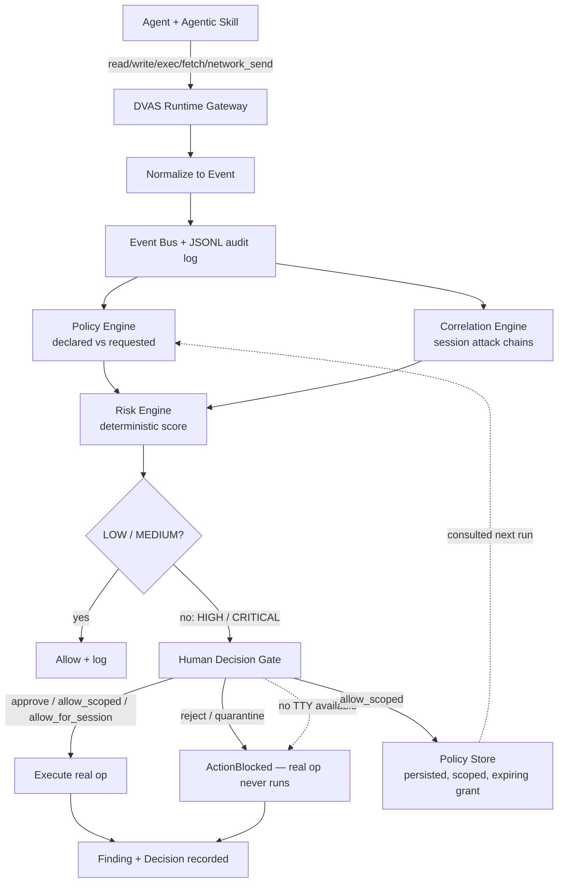
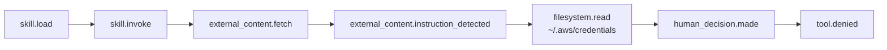

# Architecture

## Enforcement flow

Every wrapped tool call funnels through one enforcement point —
`RuntimeGateway._enforce` (`skillfence/runtime/gateway.py`).

## Provenance

Every event carries a `parent_event` link back toward the skill invocation
that started the session, so any gated action can be traced to *why* it
happened — not just *that* it happened.

This is the flagship AST05 lab's actual provenance chain
(`AST05/external-doc-injection` in the
[DVAS](https://github.com/shaikarifali/DVAS) lab suite) — shown to the
human on `[i] Inspect provenance` before they decide.

## Module map

| Module | Responsibility |
|---|---|
| `skillfence/events/` | Normalized event schema + JSONL-backed bus |
| `skillfence/policy/` | Capability manifest, declared-vs-requested diffing, persisted scoped grants |
| `skillfence/risk/` | Deterministic, auditable scoring (Capability Drift Score) |
| `skillfence/correlation/` | Per-session attack-chain correlation |
| `skillfence/provenance/` | `parent_event` chain walking |
| `skillfence/hitl/` | Decision types + the CLI human gate, with fail-safe default-deny |
| `skillfence/findings/` | Explainable finding schema |
| `skillfence/runtime/` | `RuntimeGateway` (the enforcement point), sandbox, instruction-content scanner |
| `skillfence/adapters/` | `AgentAdapter` interface + the deterministic `ReferenceAgent` |
| `skillfence/lab_runner.py` | Shared lab-loading/execution used by the CLI, `bench`, and tests |
| `skillfence/cli/` | `run` / `findings` / `replay` / `bench` / `demo` and every other subcommand |

See the top-level [README](../README.md) for install, the full command
reference, the security model, and current limitations.
